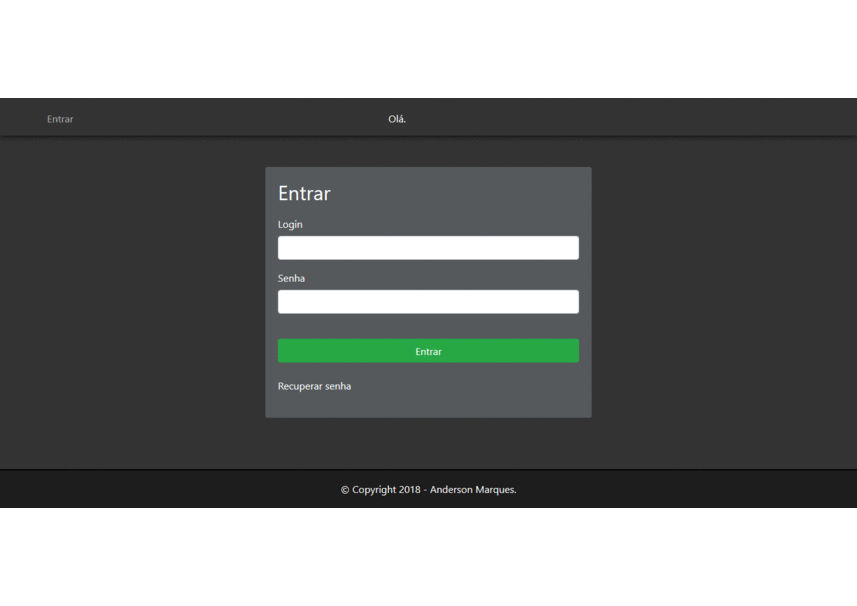

### Sistema gerenciador de tarefas acadêmicas.

Trabalho da faculdade com objetivo de construir um sistema para gerenciar tarefas acadêmicas com alerta em tela quando a data de envio de alguma atividade se aproximar.

- Em sua primeira versão, toda persistência de dados é feita com o banco de dados Access.

    

